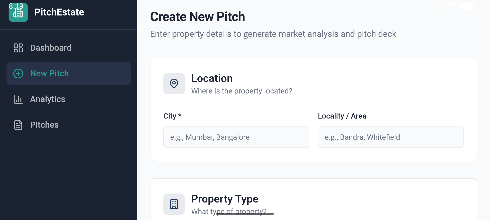
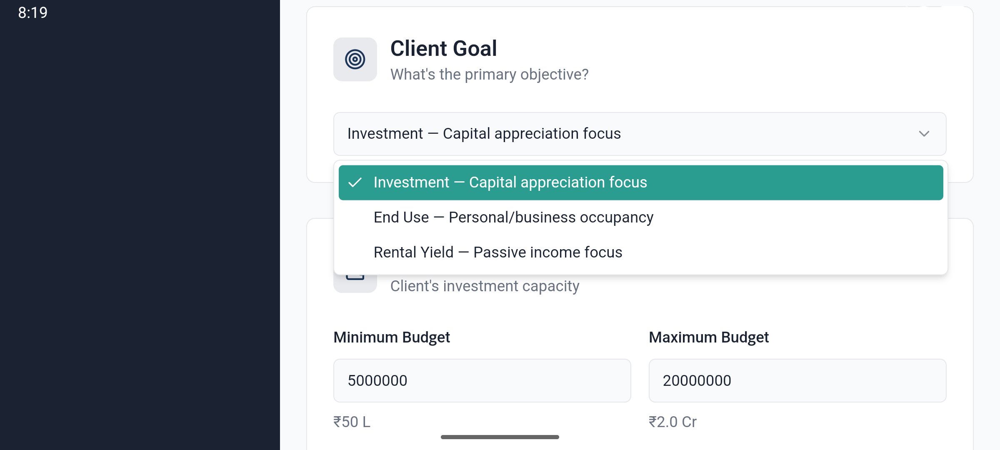
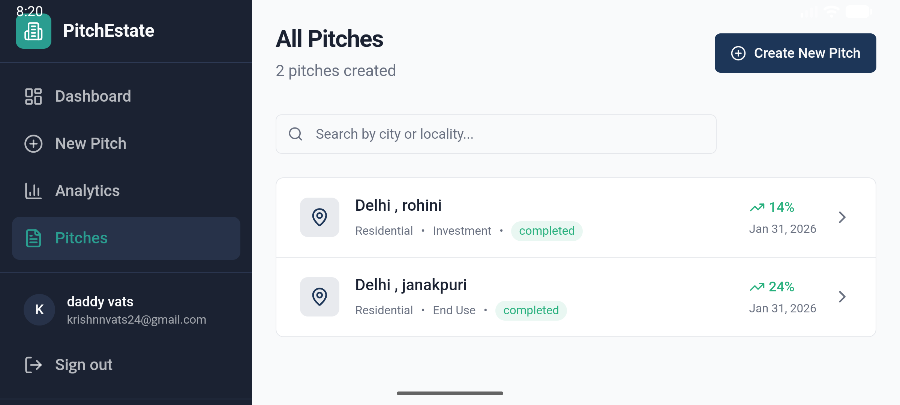

<div align="center">

# 🚀 PitchEstate  
### PitchPerfect Analytics Platform

A **cross-platform analytics & pitch-generation platform** for founders, startups, and real-estate professionals.

🌐 **Live App** → https://pitchperfect-analytics-ten.vercel.app/

</div>

---

## 📌 Overview

**PitchEstate** helps users create **data-driven pitches**, analyze performance, and manage insights through a modern dashboard.  
The application runs as a **web platform** and is also packaged as an **Android app using WebView**, ensuring reach across devices with a single codebase.

---

## ✨ Key Features

### 🧠 Pitch Creation
- Structured pitch inputs
- Clean, investor-friendly flow
- Designed for clarity and consistency

### 📊 Analytics Dashboard
- Performance insights
- ROI and growth tracking
- Card-based, easy-to-scan UI

### 🗂 Pitch Management
- Centralized pitch listing
- Individual pitch analytics
- Historical tracking

### 🌍 Cross-Platform Support
- 🌐 Web (desktop & mobile browsers)
- 📱 Android (Jetpack Compose + WebView)
- Single deployed production source

### ⚡ Fast & Lightweight
- Vite-powered frontend
- Instant updates reflected in Android app
- Optimized for demos and MVPs

---

## 📸 Screenshots

### Android Application (WebView)







---

## 🛠 Tech Stack

### Frontend (Web)
- React
- TypeScript
- Vite
- Tailwind CSS
- shadcn/ui

### Mobile (Android)
- Kotlin
- Jetpack Compose
- Android WebView

### Tooling & Hosting
- GitHub
- Vercel https://pitchperfect-analytics-ten.vercel.app/

- Node.js / npm

---

## ⚙️ Run Locally (Web)

### 1️⃣ Clone the repository
```bash
git clone https://github.com/Krishnn24/pitchperfect-analytics.git
cd pitchperfect-analytics
📱 Android App

The Android app is a native wrapper around the production web application.

Why WebView?

Single codebase

Faster development

Instant updates without Play Store redeploy

Ideal for MVPs and hackathons

Run Android App

Open project in Android Studio

Sync Gradle

Select emulator or device

💡 Use Cases

🏢 Real-estate pitch analysis

🚀 Startup pitch preparation

📈 Investor analytics dashboards

📱 Mobile-first demos

🧪 Rapid MVP & hackathon builds

🔮 Future Enhancements

User authentication

PDF / PPT pitch export

Offline Android support

Fully native mobile UI

Advanced analytics reports
